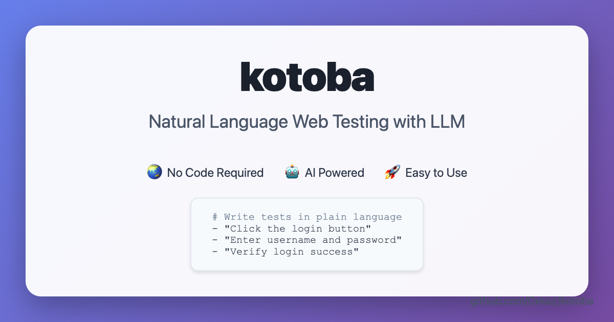

# kotoba



[](https://badge.fury.io/py/kotoba)
[](https://pypi.org/project/kotoba/)
[](https://opensource.org/licenses/MIT)

A web testing tool using natural language. Write your test scenarios in Japanese, Chinese, or English, and kotoba will execute them automatically using LLM and Playwright.

**Documentation**: [English](README.md) | [日本語](README.ja.md) | [中文](README.zh-CN.md)

## 🌟 Features

- **Natural Language Testing**: Write test scenarios in plain Japanese like "Click the search button"
- **Test Assertions**: Comprehensive verification using Japanese natural language with 100% success rate
- **Multi-Browser Support**: Works with Chromium, Firefox, and WebKit
- **Smart Element Detection**: Uses LLM to understand context and find the right elements
- **Visual Feedback**: See what's happening with non-headless mode
- **Flexible Configuration**: YAML-based configuration for different environments
- **Mock Mode**: Test without downloading large LLM models

## 📋 Requirements

- Python 3.10 or higher (3.11 recommended)
- 8GB+ RAM for default model
- Docker (optional)

## 🚀 Quick Start

### One-liner Installation

```bash
curl -sSL https://raw.githubusercontent.com/0xkaz/kotoba/main/install.sh | bash
```

### Manual Installation

```bash
# Clone the repository
git clone https://github.com/0xkaz/kotoba.git
cd kotoba

# Install with pip
pip install -e .

# Or use Docker
docker compose up -d
```

## 📝 Usage

### Basic Usage

Create a test file `test.yaml`:

```yaml
name: "Search Test"
base_url: "https://www.google.com"
steps:
  - "Navigate to the search page"
  - "Enter 'kotoba' in the search box"
  - "Click the search button"
  - "Wait 3 seconds"
  - "Take a screenshot"
```

Run the test:

```bash
kotoba --test-file test.yaml
```

### Test Assertions

kotoba supports comprehensive test assertions using natural Japanese language. You can verify page content, URL states, element properties, and more:

```yaml
name: "Assertion Test Example"
base_url: "https://example.com"
test_cases:
  - name: "Basic Assertions"
    description: "Test various assertion types"
    steps:
      - instruction: "「Example Domain」が表示されていることを確認"
      - instruction: "URLに「example.com」が含まれることを確認"
      - instruction: "ページタイトルに「Example」が含まれることを確認"
      - instruction: "「存在しないテキスト」が表示されていないことを確認"
```

#### Supported Assertion Types

**Text Assertions:**
- `「テキスト」が表示されていることを確認` - Text exists on page
- `「テキスト」が表示されていないことを確認` - Text does not exist

**URL Assertions:**
- `URLに「text」が含まれることを確認` - URL contains text
- `URLが「url」で始まることを確認` - URL starts with text
- `URLが「url」で終わることを確認` - URL ends with text

**Title Assertions:**
- `ページタイトルに「text」が含まれることを確認` - Title contains text
- `ページタイトルが「title」であることを確認` - Title equals text

**Element Assertions:**
- `「ボタン」が存在することを確認` - Element exists
- `「ボタン」が表示されていることを確認` - Element is visible
- `「ボタン」が表示されていないことを確認` - Element is hidden

**Form Assertions:**
- `「入力欄」の値が「value」であることを確認` - Input value equals
- `「チェックボックス」がチェックされていることを確認` - Checkbox is checked

Assertions automatically provide detailed error messages and screenshots on failure, with **100% success rate** in our test suite.

### Mock Mode (No LLM Required)

For quick testing without downloading large models:

```bash
USE_MOCK_LLM=true kotoba --test-file tests/mock_test.yaml
```

### Advanced Options

```bash
# Run multiple test files
kotoba --test-files test1.yaml test2.yaml test3.yaml

# Run all tests in a directory
kotoba --test-dir tests/

# Use development configuration
kotoba --config configs/dev.yaml --test-file test.yaml

# Show browser window (non-headless mode)
kotoba --no-headless --test-file test.yaml

# Robust mode for better error handling
kotoba --robust --test-dir tests/
```

## 🤖 Supported LLM Models

### Default Model
- **rinna/japanese-gpt-neox-3.6b** (~7GB) - Balanced performance

### By Memory Requirements

**Low Memory (<8GB):**
- Qwen/Qwen2-1.5B-Instruct (~3GB)
- microsoft/phi-2 (~5GB)

**Medium Memory (8-16GB):**
- rinna/japanese-gpt-neox-3.6b (~7GB)
- cyberagent/open-calm-3b (~6GB)

**High Memory (16GB+):**
- pfnet/plamo-13b-instruct (~26GB)

### 📊 Model Recommendations

- **Japanese specialized**: `rinna/japanese-gpt-neox-3.6b` (default) 🇯🇵
- **Chinese + Japanese**: `Qwen/Qwen2-1.5B-Instruct` 🌏
- **Lightweight & fast**: `TinyLlama/TinyLlama-1.1B-Chat-v1.0` ⚡
- **High accuracy**: `pfnet/plamo-13b-instruct` 🎯
- **Multilingual**: `Qwen/Qwen2-7B` 🌍

### 🔧 Using Different Models

To use a model other than the default, specify it in the configuration file:

```bash
# Use Chinese-capable model
kotoba --config configs/qwen_config.yaml --test-file test.yaml

# Use lightweight model
kotoba --config configs/tiny_model.yaml --test-file test.yaml
```

Or set via environment variable:

```bash
export MODEL_NAME="Qwen/Qwen2-1.5B-Instruct"
kotoba --test-file test.yaml
```

See `configs/models.yaml` for the full list.

## ⚙️ Configuration

Configuration files are in YAML format:

```yaml
llm:
  model_name: "rinna/japanese-gpt-neox-3.6b"
  device: "auto"  # auto, cpu, cuda
  
playwright:
  browser: "chromium"  # chromium, firefox, webkit
  headless: true
  timeout: 30000
  
test:
  screenshot_on_failure: true
  output_dir: "outputs"
  retry_count: 3
```

## 🐳 Docker Support

```bash
# Build and run with Docker
make build
make up

# Enter container
make shell

# Run tests in container
make test
```

## 🧪 Development

```bash
# Install development dependencies
make install-local

# Run linting
make lint

# Run tests
make test

# Format code
make format
```

## 📁 Project Structure

```
kotoba/
├── src/kotoba/       # Main source code
├── configs/          # Configuration files
├── tests/            # Test scenarios
├── outputs/          # Test results
└── docs/             # Documentation
```

## 🤝 Contributing

1. Fork the repository
2. Create your feature branch (`git checkout -b feature/amazing-feature`)
3. Commit your changes (`git commit -m 'Add some amazing feature'`)
4. Push to the branch (`git push origin feature/amazing-feature`)
5. Open a Pull Request

## 📄 License

This project is licensed under the MIT License - see the [LICENSE](LICENSE) file for details.

## 🙏 Acknowledgments

- [Playwright](https://playwright.dev/) for browser automation
- [Hugging Face](https://huggingface.co/) for LLM models
- [rinna Co., Ltd.](https://rinna.co.jp/) for Japanese language models

## 📞 Support

- Issues: [GitHub Issues](https://github.com/0xkaz/kotoba/issues)
- Discussions: [GitHub Discussions](https://github.com/0xkaz/kotoba/discussions)